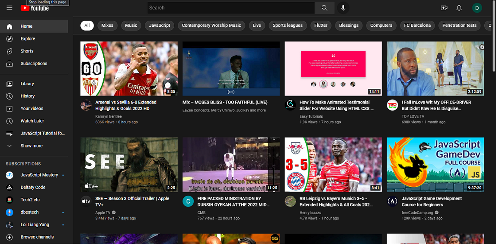

# Frontend Mentor - YouTube Clone

This is a YouTube Clone.

## Table of contents

- [Overview](#overview)
- [The challenge](#the-challenge)
- [Screenshots](#screenshots)
- [Links](#links)
- [My process](#my-process)
- [Built with](#built-with)
- [Layout](#layout)
- [Author](#author)

## Overview

### The challenge

Users should be able to:

- View the optimal layout depending on their device's screen size
- See hover states for all interactive elements on the page

### Screenshots

### Links

- Solution URL: [Frontend Mentor](https://github.com/kinjames/youtube-clone)
- Live Site URL: [Github](https://kinjames.github.io/youtube-clone/)

## My process

### Built with

- Semantic HTML5 markup
- CSS custom properties
- Scss
- CSS Grid
- Flexbox
- JavaScript

### Layout

The designs were created to the following widths:

- Mobile: 375px
- Desktop: 1140px

## Author

- Frontend Mentor - [@kinjames](https://www.frontendmentor.io/profile/kinjames)
- Twitter - [@TheBlackCoder7](https://twitter.com/TheBlackCoder7)
